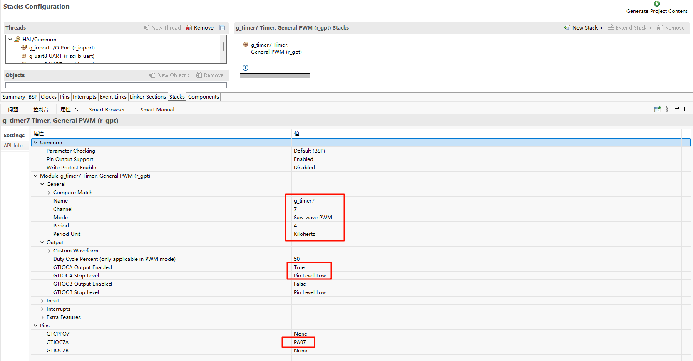
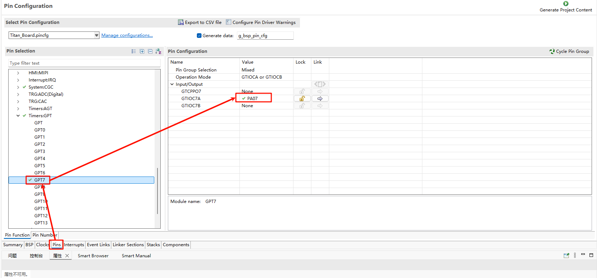
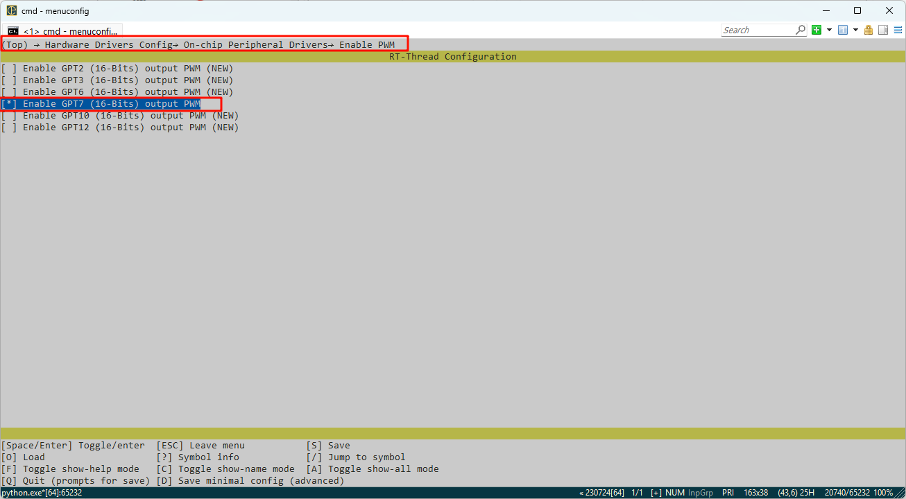

# RA8P1 Titan Board GPT Usage Guide

**English** | [**Chinese**](./README.md)

## Introduction

In our specific application scenarios, the use of timers is often indispensable. This example mainly introduces how to use the GPT device on the Titan Board.

## FSP Configuration Instructions

The FSP is configured to enable  GPT7 as a PWM mode:



Additionally, the pins for GPT7 are enabled:



### 

In the configuration, enable  PWM7:



### Example Project Instructions

The source code for this example is located in `/projects/Titan_basic_buzzer/src/buzzer.c`：

```c
#include <rtthread.h>
#include <rtdevice.h>

#define PWM_DEV_NAME        "pwm7"  /* PWM设备名称 */
#define PWM_DEV_CHANNEL     0       /* PWM通道 */

struct rt_device_pwm *pwm_dev;

typedef struct
{
    uint16_t freq;   // 频率Hz
    uint16_t duration; // 持续时间ms
} note_t;

note_t song[] =
{
    {262,400}, {294,400}, {330,400}, {262,400},  // 1 2 3 1
    {262,400}, {294,400}, {330,400}, {262,400},  // 1 2 3 1
    {330,400}, {349,400}, {392,800},             // 3 4 5
    {330,400}, {349,400}, {392,800},             // 3 4 5
    {392,200}, {440,200}, {392,200}, {349,200}, {330,400}, {262,400}, // 5 6 5 4 3 1
    {392,200}, {440,200}, {392,200}, {349,200}, {330,400}, {262,400}, // 5 6 5 4 3 1
    {262,400}, {196,400}, {262,400}, {0,400},    // 1(低) 7(低) 1 高 休止
    {262,400}, {196,400}, {262,400}, {0,400},    // 1 7 1 休止
};

static int buzzer_test(void)
{
    pwm_dev = (struct rt_device_pwm *)rt_device_find(PWM_DEV_NAME);
    if (!pwm_dev)
    {
        rt_kprintf("Cannot find PWM device %s\n", PWM_DEV_NAME);
        return -1;
    }

    for (size_t i = 0; i < sizeof(song)/sizeof(song[0]); i++)
    {
        if (song[i].freq == 0)
        {
            rt_pwm_disable(pwm_dev, PWM_DEV_CHANNEL);
        }
        else
        {
            uint32_t period_ns = 1000000000 / song[i].freq;  // ns
            uint32_t pulse_ns  = period_ns / 2;              // 50%

            rt_pwm_set(pwm_dev, PWM_DEV_CHANNEL, period_ns, pulse_ns);
            rt_pwm_enable(pwm_dev, PWM_DEV_CHANNEL);
        }

        rt_thread_mdelay(song[i].duration);
    }

    rt_pwm_disable(pwm_dev, PWM_DEV_CHANNEL);
    return 0;
}
MSH_CMD_EXPORT(buzzer_test, Play song on buzzer);
```

## Compilation & Download

* **RT-Thread Studio**: Download the Titan Board resource package in the RT-Thread Studio package manager, then create a new project and compile it.

After compilation, connect the development board's Jlink interface to the PC, and download the firmware to the development board.

## Running Results

In the serial terminal, input `buzzer_sample`  to see the specific results, and the buzzer will emit a melody.
