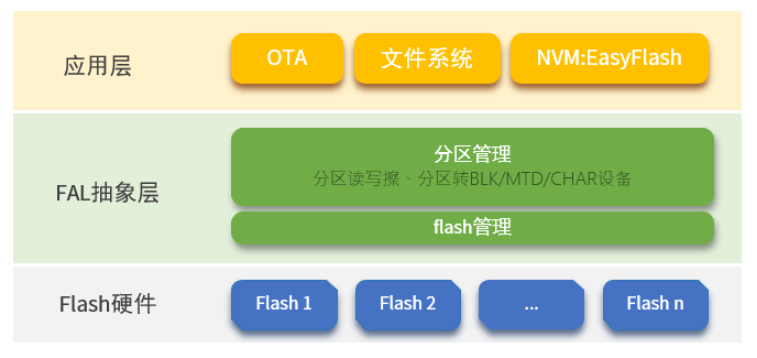
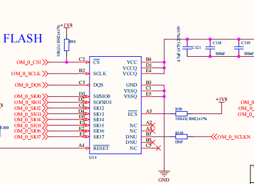
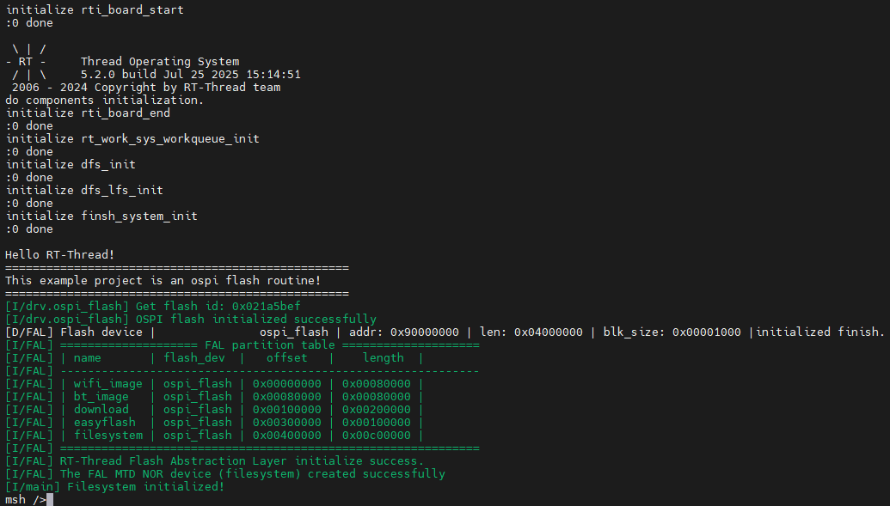

# RA8P1 Titan Board Ospi Flash Usage Guide

**English** | [**Chinese**](./README.md)

## Introduction

- FAL (Flash Abstraction Layer) is an abstraction layer for managing and operating Flash devices and Flash-based partitions. It provides a unified API for upper-layer Flash and partition operations (as shown in the framework diagram below), with the following features:
  - Supports a statically configurable partition table, which can be associated with multiple Flash devices.
  - The partition table supports **automatic loading**, avoiding the issue of the partition table being repeatedly defined in multi-firmware projects.
  - Lightweight code with **no dependency on an operating system**, allowing it to run on bare-metal platforms, such as bootloaders with limited resources.
  - A unified operation interface ensures the reusability of underlying Flash drivers for components that rely on Flash, such as file systems, OTA, and NVM (e.g., [EasyFlash](https://github.com/armink-rtt-pkgs/EasyFlash)).
  - Built-in Finsh/MSH-based test commands, enabling developers to read, write, and erase Flash or partitions via shell commands with byte-level addressing, which facilitates debugging and testing.



In this example, the Titan Board onboard GD Flash is combined with the RT-Thread FAL component to build a file system using littlefs.

## Hardware Overview



## Software Overview

The source code for file system initialization in this example is located at: `./board/ports/filesystem/drv_filesystem.c` 中：

```c
/*
 * Copyright (c) 2006-2021, RT-Thread Development Team
 *
 * SPDX-License-Identifier: Apache-2.0
 *
 * Change Logs:
 * Date           Author       Notes
 * 2018-12-13     balanceTWK   add sdcard port file
 * 2021-05-10     Meco Man     fix a bug that cannot use fatfs in the main thread at starting up
 * 2021-07-28     Meco Man     implement romfs as the root filesystem
 */

#include <rtthread.h>
#include <dfs_romfs.h>
#include <dfs_fs.h>
#include <dfs_file.h>

#if DFS_FILESYSTEMS_MAX < 4
#error "Please define DFS_FILESYSTEMS_MAX more than 4"
#endif
#if DFS_FILESYSTEM_TYPES_MAX < 4
#error "Please define DFS_FILESYSTEM_TYPES_MAX more than 4"
#endif

#define DBG_TAG "app.filesystem"
#define DBG_LVL DBG_INFO
#include <rtdbg.h>

#ifdef BSP_USING_FS_AUTO_MOUNT
#ifdef BSP_USING_SDCARD_FATFS
static int onboard_sdcard_mount(void)
{
    if (dfs_mount("sd", "/sdcard", "elm", 0, 0) == RT_EOK)
    {
        LOG_I("SD card mount to '/sdcard'");
    }
    else
    {
        LOG_E("SD card mount to '/sdcard' failed!");
    }

    return RT_EOK;
}
#endif /* BSP_USING_SDCARD_FATFS */
#endif /* BSP_USING_FS_AUTO_MOUNT */

#ifdef BSP_USING_FLASH_FS_AUTO_MOUNT
#ifdef BSP_USING_FLASH_FATFS
#define FS_PARTITION_NAME "filesystem"

static int onboard_fal_mount(void)
{
    /* Initialize the fal function */
    extern int fal_init(void);
    extern struct rt_device* fal_mtd_nor_device_create(const char *parition_name);
    fal_init ();
    /* Create a block device on the partition named "filesystem" in spi flash */
    struct rt_device *mtd_dev = fal_mtd_nor_device_create (FS_PARTITION_NAME);
    if (mtd_dev == NULL)
    {
        LOG_E("Can't create a mtd device on '%s' partition.", FS_PARTITION_NAME);
        return -RT_ERROR;
    }
    else
    {
        LOG_D("Create a mtd device on the %s partition of flash successful.", FS_PARTITION_NAME);
    }

    /* Mount the filesystem on the spi flash partition named "filesystem" */
    if (dfs_mount (FS_PARTITION_NAME, "/", "lfs", 0, 0) == 0)
    {
        LOG_I("Filesystem initialized!");
    }
    else
    {
        dfs_mkfs ("lfs", FS_PARTITION_NAME);
        if (dfs_mount ("filesystem", "/", "lfs", 0, 0) == 0)
        {
            LOG_I("Filesystem initialized!");
        }
        else
        {
            LOG_E("Failed to initialize filesystem!");
        }
    }

    return RT_EOK;
}
#endif /*BSP_USING_FLASH_FATFS*/
#endif /*BSP_USING_FLASH_FS_AUTO_MOUNT*/

const struct romfs_dirent _romfs_root[] =
{
#ifdef BSP_USING_SDCARD_FATFS
    {ROMFS_DIRENT_DIR, "sdcard", RT_NULL, 0},
#endif

#ifdef BSP_USING_FLASH_FATFS
  { ROMFS_DIRENT_DIR, "fal", RT_NULL, 0 },
#endif
};

const struct romfs_dirent romfs_root =
{
ROMFS_DIRENT_DIR, "/", (rt_uint8_t*) _romfs_root, sizeof(_romfs_root) / sizeof(_romfs_root[0])
};

static int filesystem_mount(void)
{

#ifdef BSP_USING_FS
    if (dfs_mount(RT_NULL, "/", "rom", 0, &(romfs_root)) != 0)
    {
        LOG_E("rom mount to '/' failed!");
    }

    /* Ensure that the block device is successfully registered before mounting the filesystem */
    rt_thread_delay(500);
#endif
#ifdef BSP_USING_FS_AUTO_MOUNT
    onboard_sdcard_mount();
#endif /* BSP_USING_FS_AUTO_MOUNT */

#ifdef BSP_USING_FLASH_FS_AUTO_MOUNT
    onboard_fal_mount ();
#endif

    return RT_EOK;
}
INIT_COMPONENT_EXPORT(filesystem_mount);

```

## Build & Download

* **RT-Thread Studio:** Download the Titan Board resource pack from the RT-Thread Studio package manager, then create a new project and compile it.


Once compiled, connect the development board’s JLink interface to the PC, and download the firmware to the development board.

## Running Result

Press the reset button to restart the development board and observe the terminal logs from the board.

