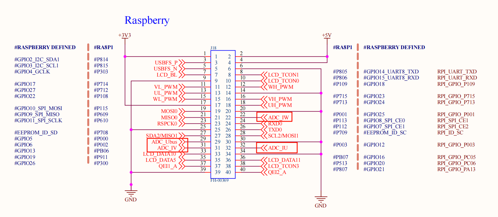
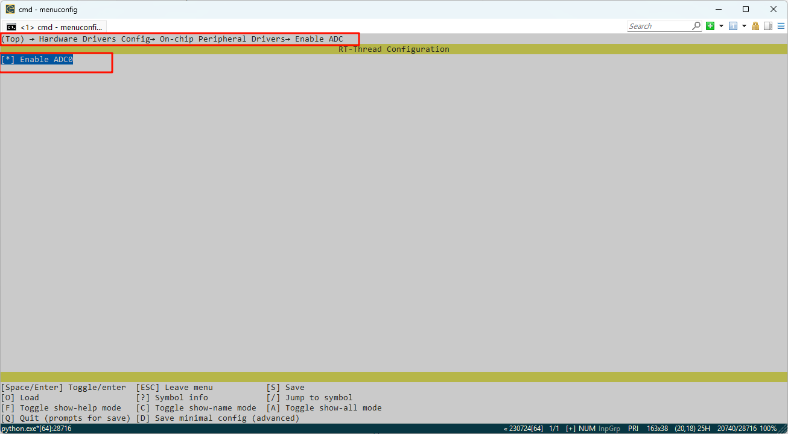

# RA8P1 Titan Board ADC应用示例说明

**中文** | [**English**](./README_EN.md)

## 简介

本例程主要介绍了如何在 Titan Board 上使用 RT-Thread 的 ADC 框架完成通过 ADC 采集模拟信号并进行数字信号的转换，主要内容如下：

## 硬件说明



如上述原理图所示：Titan Board 上留有 4 个 ADC 通道接口分别连接到单片机 adc0的通道0、1、2、3。

## FSP配置说明

* 第一步：打开FSP导入xml配置文件；（或者直接点击 RT-Thread Studio 的 FSP 链接文件）；
* 第二步：新建 r_adc Stack 配置 adc 设备以及所用通道;


* 第三步：保存并点击 Generate Project；生成的代码保存到 hal_data.c 中；


## env配置

使用 env 工具打开 adc0 的外设



## 工程实例说明

ADC 的源代码位于`/projects/Titan_driver_adc/src/hal_entry.c` 中，使用的宏定义如下所示：


具体功能为每隔 1000ms 对 ADC0 的通道 1 采集一次模拟电压并进行一次转化，代码如下：

```c
static int adc_vol_sample()
{
    rt_adc_device_t adc_dev;
    rt_uint32_t value, vol;
    rt_err_t ret = RT_EOK;

    adc_dev = (rt_adc_device_t)rt_device_find(ADC_DEV_NAME);
    if (adc_dev == RT_NULL)
    {
        rt_kprintf("adc sample run failed! can't find %s device!\n", ADC_DEV_NAME);
        return RT_ERROR;
    }

    ret = rt_adc_enable(adc_dev, ADC_DEV_CHANNEL);

    while(1)
    {
        value = rt_adc_read(adc_dev, ADC_DEV_CHANNEL);
        rt_kprintf("the value is :%d \n", value);

        vol = value * REFER_VOLTAGE / CONVERT_BITS;
        rt_kprintf("the voltage is :%d.%02d \n", vol / 100, vol % 100);

        rt_thread_mdelay(1000);
    }

    ret = rt_adc_disable(adc_dev, ADC_DEV_CHANNEL);

    return ret;
}
```

示例中 While 循环每隔 1000ms 调用一次 adc_vol_sample;

## 编译&下载

* RT-Thread Studio：在 RT-Thread Studio 的包管理器中下载 Titan Board 资源包，然后创建新工程，执行编译。

编译完成后，将开发板的 Jlink 接口与 PC 机连接，然后将固件下载至开发板。

## 运行效果

使用 adc0 的 1通道采集 1.8v 电压效果如下：


