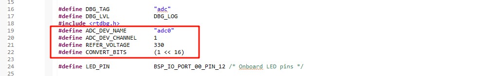

# RA8P1 Titan Board ADC Application Example Usage Instructions

**English** | [**Chinese**](./README.md)

## Introduction

This example demonstrates how to use the RT-Thread ADC framework on the Titan Board to collect analog signals via ADC and perform digital signal conversion. The main content includes the following:

## Hardware Description


As shown in the above schematic diagram, there are four ADC channel interfaces left on the Titan Board that are connected to the channels 0, 1, 2, and 3 of the MCU adc0 respectively.

## FSP Configuration Instructions

* Step 1: Open FSP and import the XML configuration file (or directly click the FSP link file in RT-Thread Studio).
* Step 2: Create a new `r_adc` stack, configure the ADC device, and select the channels to be used.


* Step 3: Save and click "Generate Project". The generated code will be saved in `hal_data.c`.

## ENV Configuration

Use the `env` tool to enable ADC0 peripheral:


## Example Code Description

The ADC source code is located in `/projects/Titan_driver_adc/src/hal_entry.c`. The macros used are defined as follows:



The specific function is to sample the analog voltage from ADC0 channel 1 every 1000ms and perform a conversion. The code is as follows:

```c
static int adc_vol_sample()
{
    rt_adc_device_t adc_dev;
    rt_uint32_t value, vol;
    rt_err_t ret = RT_EOK;

    adc_dev = (rt_adc_device_t)rt_device_find(ADC_DEV_NAME);
    if (adc_dev == RT_NULL)
    {
        rt_kprintf("adc sample run failed! can't find %s device!\n", ADC_DEV_NAME);
        return RT_ERROR;
    }

    ret = rt_adc_enable(adc_dev, ADC_DEV_CHANNEL);

    while(1)
    {
        value = rt_adc_read(adc_dev, ADC_DEV_CHANNEL);
        rt_kprintf("the value is :%d \n", value);

        vol = value * REFER_VOLTAGE / CONVERT_BITS;
        rt_kprintf("the voltage is :%d.%02d \n", vol / 100, vol % 100);

        rt_thread_mdelay(1000);
    }

    ret = rt_adc_disable(adc_dev, ADC_DEV_CHANNEL);

    return ret;
}
```

In the example, the `while` loop calls `adc_vol_sample` every 1000ms.

## Compilation & Download

* **RT-Thread Studio**: In RT-Thread Studio’s package manager, download the Titan Board resource package, create a new project, and compile it.

After compilation, connect the development board’s JLink interface to the PC and download the firmware to the development board.

## Run Effect

The effect when using ADC0 channel 1 to sample a 1.8V voltage is shown below:

