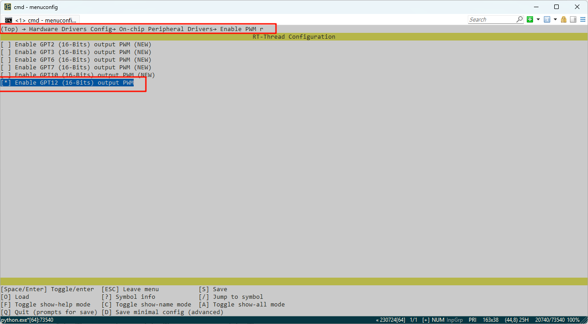

# RA8P1 Titan Board 开发板 GPT 使用说明

**中文** | [**English**](./README_EN.md)

## 简介

在我们具体的应用场合中往往都离不开 timer 的使用，本例程主要介绍了如何在 Titan Board 上使用 GPT 设备，包括基本定时器的使用和 PWM 的使用。

## FSP配置说明

FSP 分别配置使能 GPT1 为基本定时器模式，GPT12 为 PWM 模式：


并配置 Pins 使能 GPT12：


### RT-Thread Settings配置

在配置中打开 timer1 使能与 PWM12 使能：




### 示例工程说明

本例程的源码位于`/projects/Titan_driver_gpt`：

```c
/* This is a hwtimer example */
#define HWTIMER_DEV_NAME "timer1" /* device name */
static rt_err_t timeout_cb(rt_device_t dev, rt_size_t size)
{
    rt_kprintf("this is hwtimer timeout callback fucntion!\n");
    rt_kprintf("tick is :%d !\n", rt_tick_get());
    return RT_EOK;
}

int hwtimer_sample(void)
{
    rt_err_t ret = RT_EOK;
    rt_hwtimerval_t timeout_s;
    rt_device_t hw_dev = RT_NULL;
    rt_hwtimer_mode_t mode;

    rt_uint32_t freq = R_FSP_SystemClockHzGet(FSP_PRIV_CLOCK_PCLKD) >> g_timer1_cfg.source_div;
    rt_kprintf("GPT Timer clock freq is: %d hz\n", freq);

    hw_dev = rt_device_find(HWTIMER_DEV_NAME);
    if (hw_dev == RT_NULL)
    {
        rt_kprintf("hwtimer sample run failed! can't find %s device!\n", HWTIMER_DEV_NAME);
        return -RT_ERROR;
    }

    ret = rt_device_open(hw_dev, RT_DEVICE_OFLAG_RDWR);
    if (ret != RT_EOK)
    {
        rt_kprintf("open %s device failed!\n", HWTIMER_DEV_NAME);
        return ret;
    }

    rt_device_set_rx_indicate(hw_dev, timeout_cb);

    rt_device_control(hw_dev, HWTIMER_CTRL_FREQ_SET, &freq);

    mode = HWTIMER_MODE_PERIOD;
    ret = rt_device_control(hw_dev, HWTIMER_CTRL_MODE_SET, &mode);
    if (ret != RT_EOK)
    {
        rt_kprintf("set mode failed! ret is :%d\n", ret);
        return ret;
    }

    /* Example Set the timeout period of the timer */
    timeout_s.sec = 1;  /* secend */
    timeout_s.usec = 0; /* microsecend */
    if (rt_device_write(hw_dev, 0, &timeout_s, sizeof(timeout_s)) != sizeof(timeout_s))
    {
        rt_kprintf("set timeout value failed\n");
        return -RT_ERROR;
    }

    /* read hwtimer value */
    rt_device_read(hw_dev, 0, &timeout_s, sizeof(timeout_s));
    rt_kprintf("Read: Sec = %d, Usec = %d\n", timeout_s.sec, timeout_s.usec);

    return ret;
}
MSH_CMD_EXPORT(hwtimer_sample, hwtimer sample);
```
每隔 1s 触发一次中断回调函数打印输出，下面是 PWM 配置使能：

PWM 相关宏定义：

当前版本的 PWM 驱动将每个通道都看做一个单独的 PWM 设备，每个设备都只有一个通道 0。使用 PWM12 设备，注意此处通道选择为 0 通道；

```c
#define PWM_DEV_NAME        "pwm12" /* PWM设备名称 */
#define PWM_DEV_CHANNEL      0      /* PWM通道 */
struct rt_device_pwm *pwm_dev;      /* PWM设备句柄 */
```

配置 PWM 周期以及占空比：

```
static int pwm_sample(int argc, char *argv[])
{
    rt_uint32_t period, pulse;

    if (argc != 3)
    {
        LOG_I("Usage: pwm_sample <period> <pulse>");
        LOG_I("Example: pwm_sample 500000 250000");
        return -RT_ERROR;
    }

    period = (rt_uint32_t)atoi(argv[1]);
    pulse  = (rt_uint32_t)atoi(argv[2]);

    if (period == 0 || pulse > period)
    {
        LOG_E("Error: Invalid parameters. Ensure period > 0 and pulse <= period.");
        return -RT_ERROR;
    }

    pwm_dev = (struct rt_device_pwm *)rt_device_find(PWM_DEV_NAME);
    if (pwm_dev == RT_NULL)
    {
        LOG_E("Error: Cannot find PWM device named '%s'\n", PWM_DEV_NAME);
        return -RT_ERROR;
    }

    if (rt_pwm_set(pwm_dev, PWM_DEV_CHANNEL, period, pulse) != RT_EOK)
    {
        LOG_E("Error: Failed to set PWM configuration.");
        return -RT_ERROR;
    }

    if (rt_pwm_enable(pwm_dev, PWM_DEV_CHANNEL) != RT_EOK)
    {
        LOG_E("Error: Failed to enable PWM output.");
        return -RT_ERROR;
    }

    LOG_I("PWM started on device: %s, channel: %d", PWM_DEV_NAME, PWM_DEV_CHANNEL);
    LOG_I("Period: %u ns, Pulse: %u ns", period, pulse);
    LOG_I("Please connect the \'P714\' to a logic analyzer or oscilloscope for waveform observation.");

    return RT_EOK;
}
MSH_CMD_EXPORT(pwm_sample, Configure and start PWM output: pwm_sample <period> <pulse>);
```


##  编译&下载

* RT-Thread Studio：在 RT-Thread Studio 的包管理器中下载 Titan Board 资源包，然后创建新工程，执行编译。

编译完成后，将开发板的 Jlink 接口与 PC 机连接，然后将固件下载至开发板。

## 运行效果

在串口终端分别输入pwm_sample、hwtimer_sample查看具体效果；

每隔 1s 触发回调函数并打印输出：


使用逻辑分析仪量取 PWM 输出波形如下所示：


