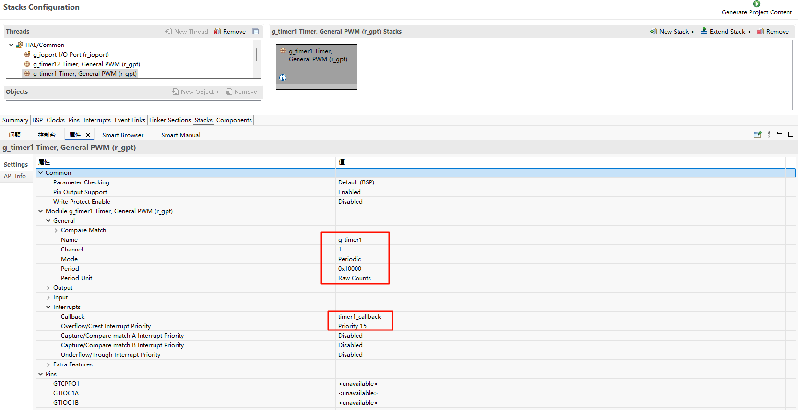
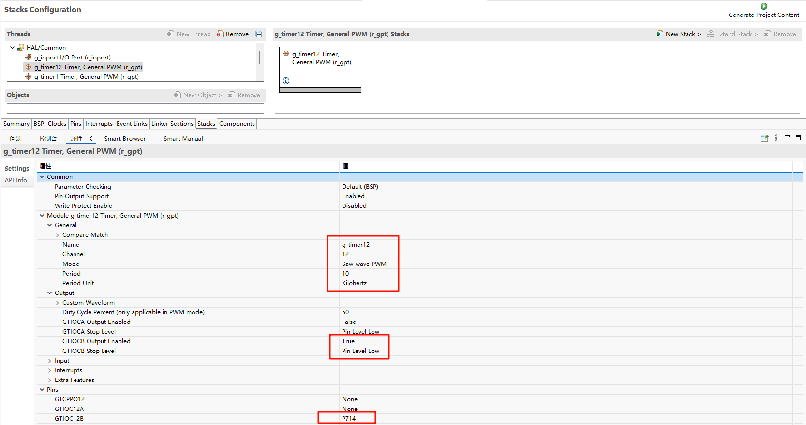
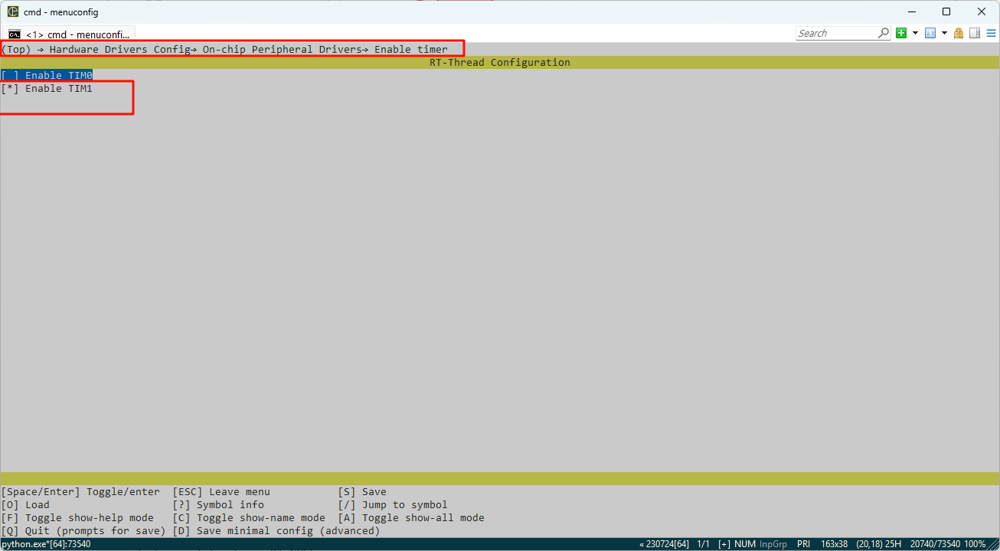
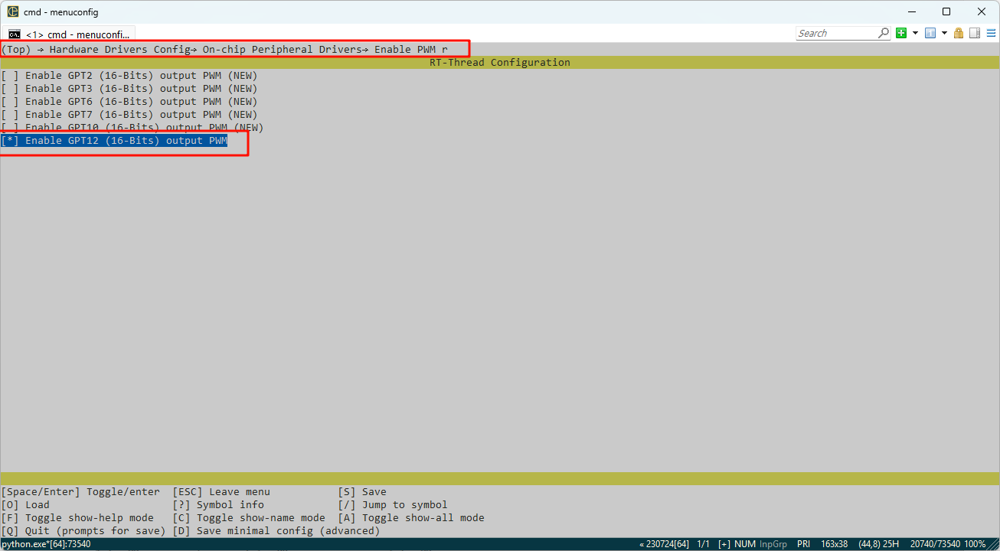
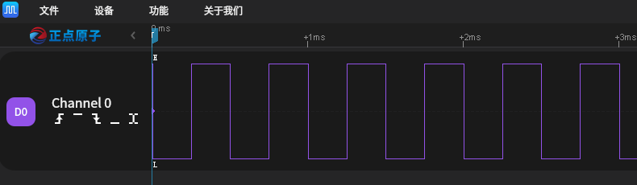

# RA8P1 Titan Board GPT Usage Guide

**English** | [**Chinese**](./README.md)

## Introduction

In our specific application scenarios, the use of timers is often indispensable. This example mainly introduces how to use the GPT device on the Titan Board, including the basic timer usage and PWM usage.

## FSP Configuration Instructions

The FSP is configured to enable GPT1 as a basic timer mode and GPT12 as a PWM mode:





Additionally, the pins for GPT12 are enabled:


### 

In the configuration, enable timer1 and PWM12:





### Example Project Instructions

The source code for this example is located in `/projects/Titan_driver_gpt`：

```c
/* This is a hwtimer example */
#define HWTIMER_DEV_NAME "timer1" /* device name */
static rt_err_t timeout_cb(rt_device_t dev, rt_size_t size)
{
    rt_kprintf("this is hwtimer timeout callback fucntion!\n");
    rt_kprintf("tick is :%d !\n", rt_tick_get());
    return RT_EOK;
}

int hwtimer_sample(void)
{
    rt_err_t ret = RT_EOK;
    rt_hwtimerval_t timeout_s;
    rt_device_t hw_dev = RT_NULL;
    rt_hwtimer_mode_t mode;

    rt_uint32_t freq = R_FSP_SystemClockHzGet(FSP_PRIV_CLOCK_PCLKD) >> g_timer1_cfg.source_div;
    rt_kprintf("GPT Timer clock freq is: %d hz\n", freq);

    hw_dev = rt_device_find(HWTIMER_DEV_NAME);
    if (hw_dev == RT_NULL)
    {
        rt_kprintf("hwtimer sample run failed! can't find %s device!\n", HWTIMER_DEV_NAME);
        return -RT_ERROR;
    }

    ret = rt_device_open(hw_dev, RT_DEVICE_OFLAG_RDWR);
    if (ret != RT_EOK)
    {
        rt_kprintf("open %s device failed!\n", HWTIMER_DEV_NAME);
        return ret;
    }

    rt_device_set_rx_indicate(hw_dev, timeout_cb);

    rt_device_control(hw_dev, HWTIMER_CTRL_FREQ_SET, &freq);

    mode = HWTIMER_MODE_PERIOD;
    ret = rt_device_control(hw_dev, HWTIMER_CTRL_MODE_SET, &mode);
    if (ret != RT_EOK)
    {
        rt_kprintf("set mode failed! ret is :%d\n", ret);
        return ret;
    }

    /* Example Set the timeout period of the timer */
    timeout_s.sec = 1;  /* secend */
    timeout_s.usec = 0; /* microsecend */
    if (rt_device_write(hw_dev, 0, &timeout_s, sizeof(timeout_s)) != sizeof(timeout_s))
    {
        rt_kprintf("set timeout value failed\n");
        return -RT_ERROR;
    }

    /* read hwtimer value */
    rt_device_read(hw_dev, 0, &timeout_s, sizeof(timeout_s));
    rt_kprintf("Read: Sec = %d, Usec = %d\n", timeout_s.sec, timeout_s.usec);

    return ret;
}
MSH_CMD_EXPORT(hwtimer_sample, hwtimer sample);
```

The interrupt callback function is triggered every 1 second, printing output. Below is the PWM configuration and enablement:

PWM-related macros:

The current version of the PWM driver treats each channel as a separate PWM device, with each device having only one channel (channel 0). Using the PWM12 device, note that channel 0 is selected here:

```c
#define PWM_DEV_NAME        "pwm12" /* PWM device name */
#define PWM_DEV_CHANNEL      0      /* PWM channel */
struct rt_device_pwm *pwm_dev;      /* PWM device handle */
```

Configure the PWM period and duty cycle:

```
static int pwm_sample(int argc, char *argv[])
{
    rt_uint32_t period, pulse;

    if (argc != 3)
    {
        LOG_I("Usage: pwm_sample <period> <pulse>");
        LOG_I("Example: pwm_sample 500000 250000");
        return -RT_ERROR;
    }

    period = (rt_uint32_t)atoi(argv[1]);
    pulse  = (rt_uint32_t)atoi(argv[2]);

    if (period == 0 || pulse > period)
    {
        LOG_E("Error: Invalid parameters. Ensure period > 0 and pulse <= period.");
        return -RT_ERROR;
    }

    pwm_dev = (struct rt_device_pwm *)rt_device_find(PWM_DEV_NAME);
    if (pwm_dev == RT_NULL)
    {
        LOG_E("Error: Cannot find PWM device named '%s'\n", PWM_DEV_NAME);
        return -RT_ERROR;
    }

    if (rt_pwm_set(pwm_dev, PWM_DEV_CHANNEL, period, pulse) != RT_EOK)
    {
        LOG_E("Error: Failed to set PWM configuration.");
        return -RT_ERROR;
    }

    if (rt_pwm_enable(pwm_dev, PWM_DEV_CHANNEL) != RT_EOK)
    {
        LOG_E("Error: Failed to enable PWM output.");
        return -RT_ERROR;
    }

    LOG_I("PWM started on device: %s, channel: %d", PWM_DEV_NAME, PWM_DEV_CHANNEL);
    LOG_I("Period: %u ns, Pulse: %u ns", period, pulse);
    LOG_I("Please connect the \'P714\' to a logic analyzer or oscilloscope for waveform observation.");

    return RT_EOK;
}
MSH_CMD_EXPORT(pwm_sample, Configure and start PWM output: pwm_sample <period> <pulse>);
```

## Compilation & Download

* **RT-Thread Studio**: Download the Titan Board resource package in the RT-Thread Studio package manager, then create a new project and compile it.

After compilation, connect the development board's Jlink interface to the PC, and download the firmware to the development board.

## Running Results

In the serial terminal, input `pwm_sample` and `hwtimer_sample` to see the specific results.

The callback function is triggered every 1 second, and the output is printed:


Using a logic analyzer, the PWM output waveform is measured as follows:

