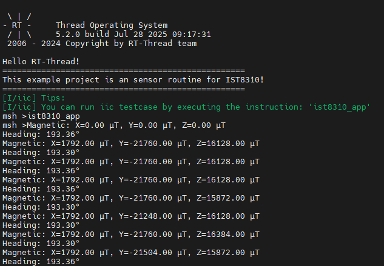

# RA8P1 Titan Board IST8310 Example Usage Instructions

**English** | [**Chinese**](./README.md)

## Introduction

This routine focuses on how to communicate with the IST8310 magnetometer module using RT-Thread's IIC framework on the Titan Board.

## Hardware Description

Titan Board uses IIC2 to communicate with IST8310.


## FSP Configuration Instructions

Create a new stack and select `r_iic_master`. Then, configure the I2C2 settings as shown below:


## RT-Thread Settings Configuration

Enable the RT-Thread I2C driver framework and the IST8310 driver software package in the configuration.


## Example Project Description

The magnetometer data communication is realized based on the driver software package IST8310.

```c
/*
* Copyright (c) 2006-2025, RT-Thread Development Team
*
* SPDX-License-Identifier: Apache-2.0
*
* Change Logs:
* Date           Author        Notes
* 2025-06-13     kurisaW       first version
*/

#include <rtthread.h>
#include "ist8310.h"

static void ist8310_entry()
{
    ist8310_device_t dev = ist8310_init(IST8310_SAMPLE_I2C_DEV_NAME);
    if (dev == RT_NULL) {
        rt_kprintf("IST8310 init failed\n");
        return;
    }

    /* Set the magnetic declination Angle (set according to the actual position) */
    ist8310_set_declination(dev, 0.15f);  /* For example: 0.15 radians */

    while (1)
    {
        ist8310_data_t data;
        if (ist8310_read_magnetometer(dev, &data) == RT_EOK)
        {
            rt_kprintf("Magnetic: X=%.2f µT, Y=%.2f µT, Z=%.2f µT\n", data.x, data.y, data.z);
        }

        float heading = ist8310_read_heading(dev);
        rt_kprintf("Heading: %.2f°\n", heading);

        rt_thread_mdelay(1000);
    }
}

void ist8310_app()
{
    rt_thread_t ist8310 = rt_thread_create("ist8310", ist8310_entry, RT_NULL, 2048, 20, 10);
    if(ist8310 != RT_NULL)
    {
        rt_thread_startup(ist8310);
    }

    return;
}
MSH_CMD_EXPORT(ist8310_app, IST8310 app);
```

## Compilation & Download

* **RT-Thread Studio**: In RT-Thread Studio’s package manager, download the Titan Board resource package, create a new project, and compile it.

After compilation, connect the development board’s JLink interface to the PC and download the firmware to the development board.

## Run Effect

Input ist8310_app command in serial port terminal:

