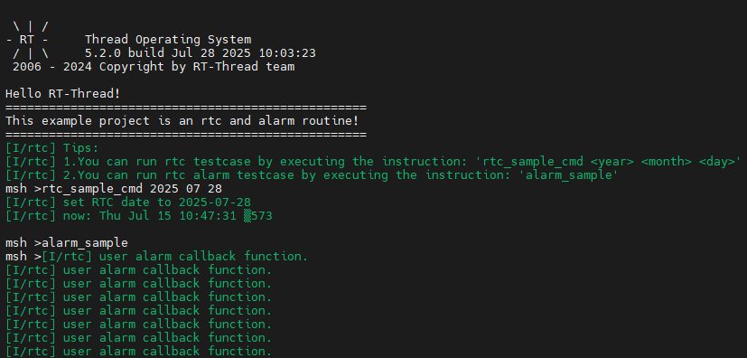

# RA8P1 Titan Board 开发板 RTC 及 alarm 使用例程说明

**中文**|[**English**](README_EN.md)

## 简介

本例程主要介绍了如何在 Titan Board 上使用 RTC（Real-Time Clock）实时时钟，RTC 可以提供精确的实时时间，它可以用于产生年、月、日、时、分、秒等信息。目前实时时钟芯片大多采用精度较高的晶体振荡器作为时钟源。有些时钟芯片为了在主电源掉电时还可以工作，会外加电池供电，使时间信息一直保持有效。

RT-Thread 的 RTC 设备为操作系统的时间系统提供了基础服务。面对越来越多的 IoT 场景，RTC 已经成为产品的标配，甚至在诸如 SSL 的安全传输过程中，RTC 已经成为不可或缺的部分。

## 硬件说明

本例程使用的RTC 设备依赖于LOCO 时钟，此外无需过多连接。

## FSP配置说明

打开 FSP，选择对应的工程文件下的 configuration.xml，新增 RTC Stack;


下面进行 RTC 参数的配置，设置 rtc stack name 为 g_rtc，设置 RTC 中断回调函数为 rtc_callback，并配置中断回调优先级；


## RT-Thread Settings配置

打开 RT-Thread Settings，找到硬件选项，使能 RTC；


接下来我们配置 RTC，首先需要使能 RT-Thread 的 RTC 设备框架，同时使能 alarm 功能；


##  示例代码说明

本例程的源码位于`/projects/Titan_driver_rtc`。

```c
void rtc_sample(int year, int month, int day)
{
    rt_err_t ret = RT_EOK;
    time_t now;
    rt_device_t device = RT_NULL;

    device = rt_device_find(RTC_NAME);
    if (!device)
    {
        LOG_E("find %s failed!", RTC_NAME);
        return;
    }

    if (rt_device_open(device, 0) != RT_EOK)
    {
        LOG_E("open %s failed", RTC_NAME);
        return;
    }

    /* 设置日期 */
    ret = set_date(year, month, day);
    LOG_I("set RTC date to %04d-%02d-%02d", year, month, day);
    if (ret != RT_EOK)
    {
        LOG_E("set RTC date failed");
    }

    /* 设置时间 */
    ret = set_time(12, 0, 0);
    if (ret != RT_EOK)
    {
        LOG_E("set RTC time failed");
    }

    /* 延时3秒 */
    rt_thread_mdelay(3000);

    /* 获取时间 */
    get_timestamp(&now);
    LOG_I("now: %.*s", 25, ctime(&now));
}

static void rtc_sample_cmd(int argc, char *argv[])
{
    if (argc != 4)
    {
        rt_kprintf("Usage: rtc_sample <year> <month> <day>\n");
        return;
    }

    int year = atoi(argv[1]);
    int month = atoi(argv[2]);
    int day = atoi(argv[3]);

    rtc_sample(year, month, day);
}
MSH_CMD_EXPORT(rtc_sample_cmd, set RTC date: rtc_sample_cmd <year> <month> <day>);
```

下面代码可创建一个 RTC 闹钟，然后设置 1 秒后唤醒，最后把该函数导入 msh 命令行中。

```c
void user_alarm_callback(rt_alarm_t alarm, time_t timestamp)
{
    LOG_I("user alarm callback function.");
}

void alarm_sample(void)
{
    rt_device_t dev = rt_device_find("rtc");
    struct rt_alarm_setup setup;
    struct rt_alarm * alarm = RT_NULL;
    static time_t now;
    struct tm p_tm;

    if (alarm != RT_NULL)
        return;

    /* 获取当前时间戳，并把下一秒时间设置为闹钟时间 */
    now = get_timestamp(NULL) + 1;
    gmtime_r(&now,&p_tm);

    setup.flag = RT_ALARM_SECOND;
    setup.wktime.tm_year = p_tm.tm_year;
    setup.wktime.tm_mon = p_tm.tm_mon;
    setup.wktime.tm_mday = p_tm.tm_mday;
    setup.wktime.tm_wday = p_tm.tm_wday;
    setup.wktime.tm_hour = p_tm.tm_hour;
    setup.wktime.tm_min = p_tm.tm_min;
    setup.wktime.tm_sec = p_tm.tm_sec;

    alarm = rt_alarm_create(user_alarm_callback, &setup);
    if(RT_NULL != alarm)
    {
        rt_alarm_start(alarm);
    }
}
/* export msh cmd */
MSH_CMD_EXPORT(alarm_sample,alarm sample);
```

## 编译&下载

* RT-Thread Studio：在 RT-Thread Studio 的包管理器中下载 Titan Board 资源包，然后创建新工程，执行编译。

编译完成后，将开发板的 Jlink 接口与 PC 机连接，然后将固件下载至开发板。

## 运行效果

按下复位按键重启开发板，输入 `rtc_sample_cmd` 命令设置 RTC 时间，输入 `alarm_sample` 命令运行闹钟示例，可以看到板子上会打印如下信息：


