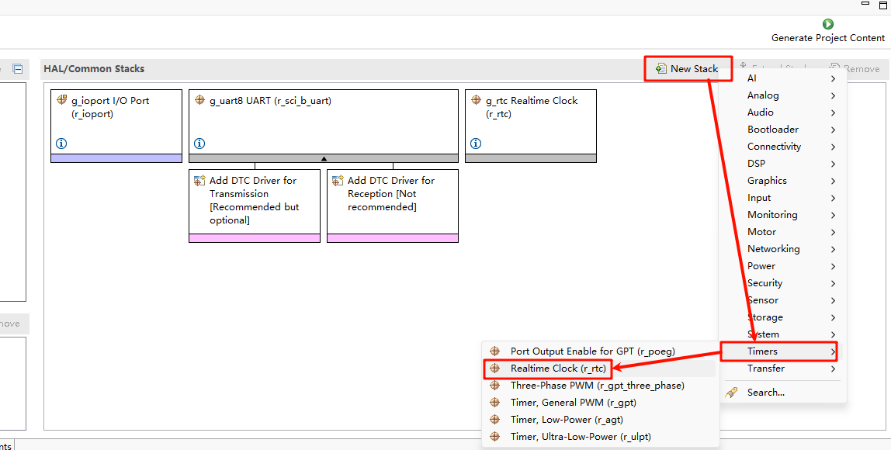
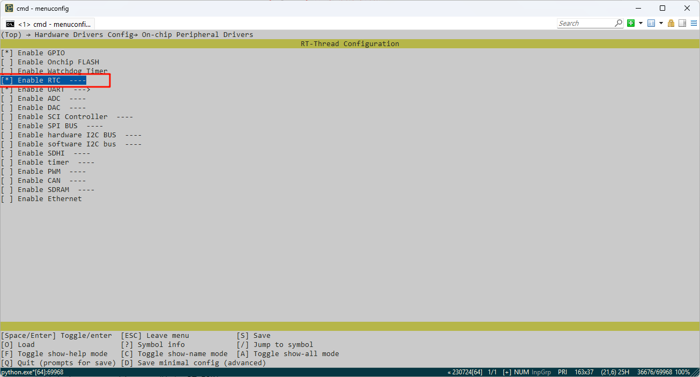
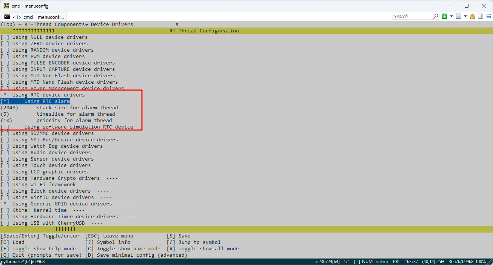

# RA8P1 Titan Board RTC and Alarm Example Usage Instructions

**English**|[**Chinese**](README.md)

## Introduction

This example demonstrates how to use the RTC (Real-Time Clock) on the Titan Board. RTC provides accurate real-time information, such as the year, month, day, hour, minute, and second. Most real-time clock chips use high-precision crystal oscillators as clock sources. Some RTC chips have a battery backup to keep time information valid when the main power supply is off.

RT-Thread’s RTC device provides foundational services for the operating system’s time system. With the increasing number of IoT scenarios, RTCs have become standard in products, and are even indispensable in secure communication protocols like SSL.

## Hardware Description

The RTC device used in this example relies on the LOCO (Low speed On Chip Oscillator) clock. No other special connections are required.

## FSP Configuration Instructions

Open the FSP configuration tool and select the `configuration.xml` file under the corresponding project directory. Add the RTC Stack:



Next, configure the RTC parameters. Set the RTC stack name to `g_rtc`, configure the RTC interrupt callback function to `rtc_callback`, and set the interrupt callback priority:


## RT-Thread Settings Configuration

Open RT-Thread Settings and enable the RTC under the hardware options:



Next, we configure the RTC. First, we need to enable the RT-Thread RTC device framework and enable the alarm function.



## Example Code Description

The source code for this example is located at `/projects/Titan_driver_rtc`。

```c
void rtc_sample(int year, int month, int day)
{
    rt_err_t ret = RT_EOK;
    time_t now;
    rt_device_t device = RT_NULL;

    device = rt_device_find(RTC_NAME);
    if (!device)
    {
        LOG_E("find %s failed!", RTC_NAME);
        return;
    }

    if (rt_device_open(device, 0) != RT_EOK)
    {
        LOG_E("open %s failed", RTC_NAME);
        return;
    }

    /* Set date */
    ret = set_date(year, month, day);
    LOG_I("set RTC date to %04d-%02d-%02d", year, month, day);
    if (ret != RT_EOK)
    {
        LOG_E("set RTC date failed");
    }

    /* Set time */
    ret = set_time(12, 0, 0);
    if (ret != RT_EOK)
    {
        LOG_E("set RTC time failed");
    }

    /* Delay for 3 seconds */
    rt_thread_mdelay(3000);

    /* Get time */
    get_timestamp(&now);
    LOG_I("now: %.*s", 25, ctime(&now));
}

static void rtc_sample_cmd(int argc, char *argv[])
{
    if (argc != 4)
    {
        rt_kprintf("Usage: rtc_sample <year> <month> <day>\n");
        return;
    }

    int year = atoi(argv[1]);
    int month = atoi(argv[2]);
    int day = atoi(argv[3]);

    rtc_sample(year, month, day);
}
MSH_CMD_EXPORT(rtc_sample_cmd, set RTC date: rtc_sample_cmd <year> <month> <day>);
```

The following code creates an RTC alarm and sets it to trigger in 1 second. Finally, the function is exported to the MSH command line.

```c
void user_alarm_callback(rt_alarm_t alarm, time_t timestamp)
{
    LOG_I("user alarm callback function.");
}

void alarm_sample(void)
{
    rt_device_t dev = rt_device_find("rtc");
    struct rt_alarm_setup setup;
    struct rt_alarm * alarm = RT_NULL;
    static time_t now;
    struct tm p_tm;

    if (alarm != RT_NULL)
        return;

    /* Get the current timestamp and set the alarm to trigger in the next second */
    now = get_timestamp(NULL) + 1;
    gmtime_r(&now,&p_tm);

    setup.flag = RT_ALARM_SECOND;
    setup.wktime.tm_year = p_tm.tm_year;
    setup.wktime.tm_mon = p_tm.tm_mon;
    setup.wktime.tm_mday = p_tm.tm_mday;
    setup.wktime.tm_wday = p_tm.tm_wday;
    setup.wktime.tm_hour = p_tm.tm_hour;
    setup.wktime.tm_min = p_tm.tm_min;
    setup.wktime.tm_sec = p_tm.tm_sec;

    alarm = rt_alarm_create(user_alarm_callback, &setup);
    if(RT_NULL != alarm)
    {
        rt_alarm_start(alarm);
    }
}
/* export msh cmd */
MSH_CMD_EXPORT(alarm_sample,alarm sample);
```

## Compilation & Download

* **RT-Thread Studio**: In RT-Thread Studio's package manager, download the Titan Board resource package, create a new project, and compile it.

After compilation, connect the development board's JLink interface to the PC and download the firmware to the development board.

## Run Effect

Press the reset button to restart the development board, enter the `rtc_sample_cmd` command to set the RTC time, enter the `alarm_sample` command to run the alarm clock example, you can see the following message printed on the board:

