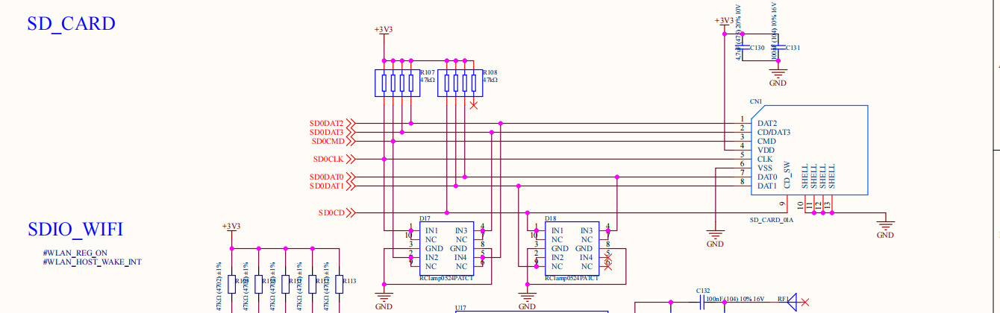
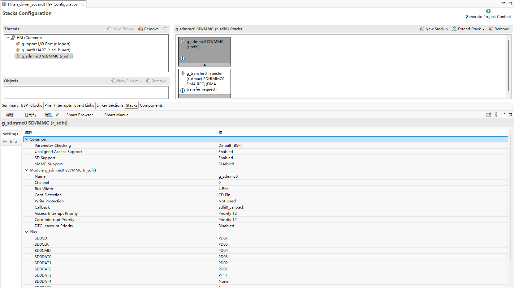
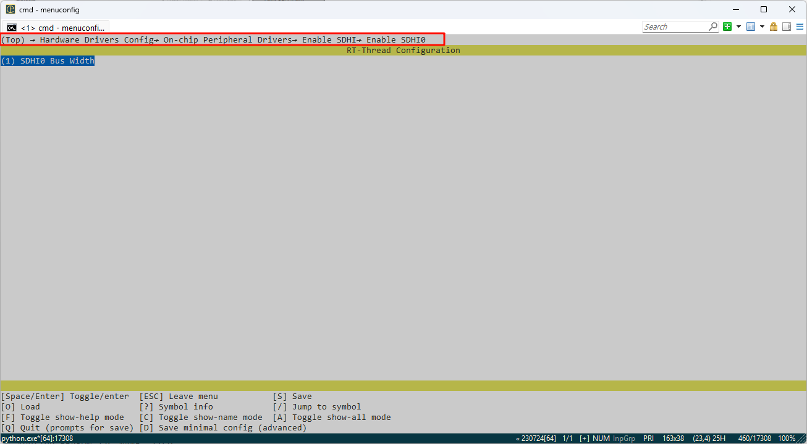

# RA8P1 Titan Board SD卡文件系统使用说明

**中文**|[**English**](README_EN.md)

## 简介

本例程使用开发板上 SD 卡槽中的 SD 卡作为文件系统的存储设备，展示如何在  SD 卡上创建文件系统（格式化卡），并挂载文件系统到 RT-Thread 操作系统中。

文件系统挂载成功后，展示如何使用文件系统提供的功能对目录和文件进行操作。

## 硬件说明

本次示例和存储器连接通过 SDIO 接口，使用的是硬件的 SDIO，原理图如下所示：



## FSP配置说明

新建 stacks 选择 r_sdhi 并配置 sdhi0 配置信息如下：




## RT-Thread Settings 配置

在配置中打开 SDHI0，并配置 Bus Width 为 1。



## 示例工程说明

本例程的文件系统初始化源码位于 `./board/ports/filesystem/drv_filesystem.c` 中：

```c
/*
 * Copyright (c) 2006-2021, RT-Thread Development Team
 *
 * SPDX-License-Identifier: Apache-2.0
 *
 * Change Logs:
 * Date           Author       Notes
 * 2018-12-13     balanceTWK   add sdcard port file
 * 2021-05-10     Meco Man     fix a bug that cannot use fatfs in the main thread at starting up
 * 2021-07-28     Meco Man     implement romfs as the root filesystem
 */

#include <rtthread.h>
#include <dfs_romfs.h>
#include <dfs_fs.h>
#include <dfs_file.h>

#if DFS_FILESYSTEMS_MAX < 4
#error "Please define DFS_FILESYSTEMS_MAX more than 4"
#endif
#if DFS_FILESYSTEM_TYPES_MAX < 4
#error "Please define DFS_FILESYSTEM_TYPES_MAX more than 4"
#endif

#define DBG_TAG "app.filesystem"
#define DBG_LVL DBG_INFO
#include <rtdbg.h>

#ifdef BSP_USING_FS_AUTO_MOUNT
#ifdef BSP_USING_SDCARD_FATFS
static int onboard_sdcard_mount(void)
{
    if (dfs_mount("sd", "/sdcard", "elm", 0, 0) == RT_EOK)
    {
        LOG_I("SD card mount to '/sdcard'");
    }
    else
    {
        LOG_E("SD card mount to '/sdcard' failed!");
    }

    return RT_EOK;
}
#endif /* BSP_USING_SDCARD_FATFS */
#endif /* BSP_USING_FS_AUTO_MOUNT */

#ifdef BSP_USING_FLASH_FS_AUTO_MOUNT
#ifdef BSP_USING_FLASH_FATFS
#define FS_PARTITION_NAME "filesystem"

static int onboard_fal_mount(void)
{
    /* 初始化 fal 功能 */
    extern int fal_init(void);
    extern struct rt_device* fal_mtd_nor_device_create(const char *parition_name);
    fal_init ();
    /* 在 spi flash 中名为 "filesystem" 的分区上创建一个块设备 */
    struct rt_device *mtd_dev = fal_mtd_nor_device_create (FS_PARTITION_NAME);
    if (mtd_dev == NULL)
    {
        LOG_E("Can't create a mtd device on '%s' partition.", FS_PARTITION_NAME);
        return -RT_ERROR;
    }
    else
    {
        LOG_D("Create a mtd device on the %s partition of flash successful.", FS_PARTITION_NAME);
    }

    /* 挂载 spi flash 中名为 "filesystem" 的分区上的文件系统 */
    if (dfs_mount (FS_PARTITION_NAME, "/", "lfs", 0, 0) == 0)
    {
        LOG_I("Filesystem initialized!");
    }
    else
    {
        dfs_mkfs ("lfs", FS_PARTITION_NAME);
        if (dfs_mount ("filesystem", "/", "lfs", 0, 0) == 0)
        {
            LOG_I("Filesystem initialized!");
        }
        else
        {
            LOG_E("Failed to initialize filesystem!");
        }
    }

    return RT_EOK;
}
#endif /*BSP_USING_FLASH_FATFS*/
#endif /*BSP_USING_FLASH_FS_AUTO_MOUNT*/

const struct romfs_dirent _romfs_root[] =
{
#ifdef BSP_USING_SDCARD_FATFS
    {ROMFS_DIRENT_DIR, "sdcard", RT_NULL, 0},
#endif

#ifdef BSP_USING_FLASH_FATFS
  { ROMFS_DIRENT_DIR, "fal", RT_NULL, 0 },
#endif
};

const struct romfs_dirent romfs_root =
{
ROMFS_DIRENT_DIR, "/", (rt_uint8_t*) _romfs_root, sizeof(_romfs_root) / sizeof(_romfs_root[0])
};

static int filesystem_mount(void)
{

#ifdef BSP_USING_FS
    if (dfs_mount(RT_NULL, "/", "rom", 0, &(romfs_root)) != 0)
    {
        LOG_E("rom mount to '/' failed!");
    }

    /* 确保块设备注册成功之后再挂载文件系统 */
    rt_thread_delay(500);
#endif
#ifdef BSP_USING_FS_AUTO_MOUNT
    onboard_sdcard_mount();
#endif /* BSP_USING_FS_AUTO_MOUNT */

#ifdef BSP_USING_FLASH_FS_AUTO_MOUNT
    onboard_fal_mount ();
#endif

    return RT_EOK;
}
INIT_COMPONENT_EXPORT(filesystem_mount);
```

## 编译&下载

* RT-Thread Studio：在RT-Thread Studio 的包管理器中下载 Titan Board 资源包，然后创建新工程，执行编译。

编译完成后，将开发板的Jlink接口与PC 机连接，然后将固件下载至开发板。

##  运行效果

按下复位按键重启开发板，等待 SD 挂载后进入 SD 卡文件系统目录查看 SD 卡上的文件。

