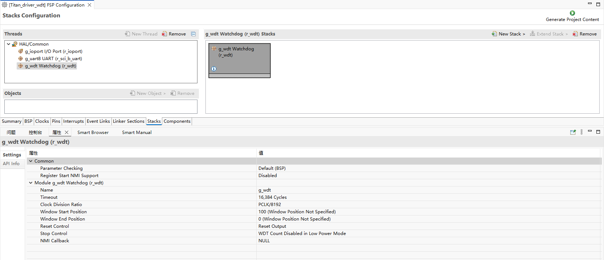
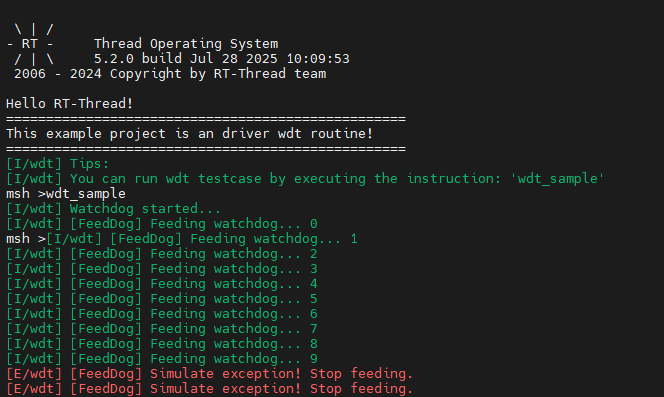

# RA8P1 Titan Board WDT Usage Instructions

**English** | [**Chinese**](./README.md)

## Instructions

Watchdog devices can ensure that our code is in our expectations, can effectively prevent our program because of some other uncontrollable factors caused exceptions; This routine mainly describes how to use the window WDT device on the Titan Board;

## Hardware Description

None

## FSP Configuration Instructions

Open the FSP tool and create a new stack, selecting `r_wdt`.



**Note:** Using WDT requires the `OFS0` register configuration to be enabled.


## RT-Thread Settings Configuration


## Example project description

The sample program is located at `projects/Titan_driver_wdt/src/hal_entry.c`.

```c
/*
 * Copyright (c) 2006-2024, RT-Thread Development Team
 *
 * SPDX-License-Identifier: Apache-2.0
 *
 * Change Logs:
 * Date           Author        Notes
 * 2024-03-11     Wangyuqiang   first version
 */

#include <rtthread.h>
#include "hal_data.h"
#include <rtdevice.h>
#include <board.h>

#define DBG_TAG "wdt"
#define DBG_LVL DBG_LOG
#include <rtdbg.h>

#define WDT_DEVICE_NAME "wdt"    // Default watchdog device name, depending on the BSP
#define WDT_FEED_INTERVAL 1000   // Feeding interval (unit: ms)
#define WDT_TIMEOUT 3            // Watchdog timeout period (unit: s)

static rt_device_t wdt_dev = RT_NULL;
static rt_thread_t feed_thread = RT_NULL;

#define LED_PIN_0    BSP_IO_PORT_06_PIN_00 /* Onboard LED pins */

void hal_entry(void)
{
    rt_kprintf("\nHello RT-Thread!\n");
    rt_kprintf("==================================================\n");
    rt_kprintf("This example project is an driver wdt routine!\n");
    rt_kprintf("==================================================\n");

    LOG_I("Tips:");
    LOG_I("You can run wdt testcase by executing the instruction: \'wdt_sample\'");

    while (1)
    {
        rt_pin_write(LED_PIN_0, PIN_HIGH);
        rt_thread_mdelay(1000);
        rt_pin_write(LED_PIN_0, PIN_LOW);
        rt_thread_mdelay(1000);
    }
}

static void feed_dog_entry(void *parameter)
{
    int count = 0;

    while (1)
    {
        if (count < 10)
        {
            rt_device_control(wdt_dev, RT_DEVICE_CTRL_WDT_KEEPALIVE, RT_NULL);
            LOG_I("[FeedDog] Feeding watchdog... %d", count);
        }
        else
        {
            LOG_E("[FeedDog] Simulate exception! Stop feeding.");
        }

        count++;
        rt_thread_mdelay(WDT_FEED_INTERVAL);
    }
}

static int wdt_sample(void)
{
    rt_err_t ret;

    wdt_dev = rt_device_find(WDT_DEVICE_NAME);
    if (wdt_dev == RT_NULL)
    {
        LOG_E("Cannot find %s device!", WDT_DEVICE_NAME);
        return -1;
    }

    ret = rt_device_control(wdt_dev, RT_DEVICE_CTRL_WDT_START, RT_NULL);
    if (ret != RT_EOK)
    {
        LOG_E("Start watchdog failed!");
        return -1;
    }

    LOG_I("Watchdog started...", WDT_TIMEOUT);

    feed_thread = rt_thread_create("feed_dog", feed_dog_entry, RT_NULL, 1024, 10, 10);
    if (feed_thread != RT_NULL)
        rt_thread_startup(feed_thread);

    return 0;
}
MSH_CMD_EXPORT(wdt_sample, wdt_sample);
```

## Compilation & Download

* **RT-Thread Studio**: Download the Titan Board resource package in the RT-Thread Studio package manager, then create a new project and compile it.

After compilation, connect the Jlink interface of the development board to the PC, and download the firmware to the development board.

## Run Effects

Enter the `wdt_sample` command at the terminal to run the WDT test program. After feeding the dog 10 times, stop feeding the dog to simulate an abnormal program situation.



## References

Device and Driver: [WDT Device](https://www.rt-thread.org/document/site/#/rt-thread-version/rt-thread-standard/programming-manual/device/watchdog/watchdog)
